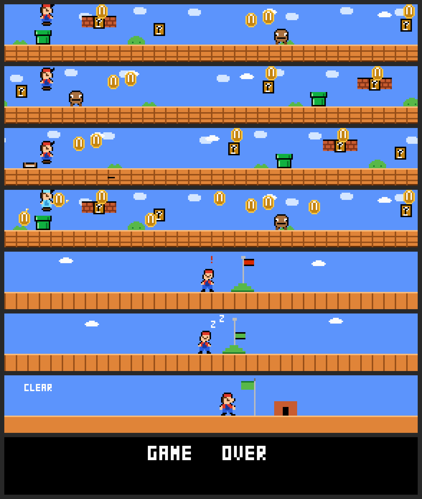
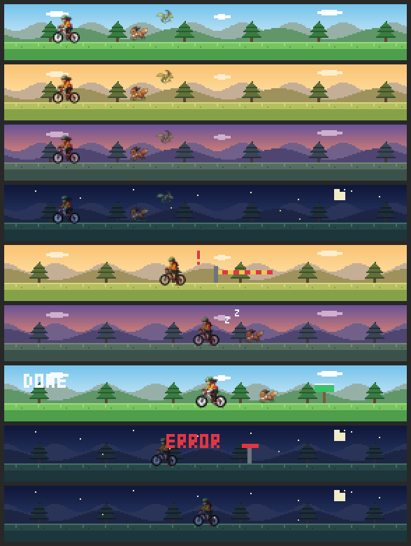

# awesome-agent-island

Community **themes** for [agent-island](https://github.com/mathur-prerit/agent-island) — the macOS
menu-bar status widget for Claude Code / coding agents — plus a small **framework** for authoring your
own theme from a plain-language spec.

agent-island themes are **data themes**: a folder with a `theme.json` manifest + sprite/image/sound
assets. No Swift, no recompiling — you install one with a single `agentisland theme add` command and
pick it from the menu-bar **Animation theme** submenu.

---

## 🎨 Themes

| Theme | Preview | Install |
|-------|---------|---------|
| **Super Mario** — a scrolling NES-style level that **powers up with your token usage** (rookie → super → fire → star), hops pipes & goombas, collects coins, with chiptune lifecycle cues. *Requires agent-island 0.4.0+.* |  | `agentisland theme add https://raw.githubusercontent.com/mathur-prerit/awesome-agent-island/main/themes/mario.zip` |
| **Pokémon Emerald Ride** — a side-scrolling forest bike ride inspired by the Emerald intro that shifts **day → golden hour → dusk → night** with token usage: a kid cycling a meadow route with a flyer overhead and a runner alongside, parallax mountains/trees, and chiptune cues. *Fan tribute — not for redistribution (see theme README). Requires agent-island 0.4.0+.* |  | `agentisland theme add ./themes/pokemon_emerald` |

> The Mario theme uses **token bands** (a 0.4.0 feature): the more tokens a session burns, the higher
> Mario's powerup tier. See [token-aware themes](#-token-aware-themes-040) below.

---

## ⬇️ Installing a theme

```sh
# From a hosted zip (one-liner):
agentisland theme add <https-url-to-theme.zip>

# …or from a folder you cloned/downloaded:
agentisland theme add ./themes/mario
```

Then open the menu-bar island ▸ **Animation theme** ▸ pick it. Enable sound cues with
`agentisland config set soundEnabled true`. Installed themes live in `~/.agent-island/themes/<id>/`
and **survive `agentisland uninstall`** (use `--purge` to remove them).

Everything `theme add` installs goes through agent-island's validated, path-safe pipeline
(size caps, zip-slip / symlink rejection, strict manifest schema), so a theme can't read outside its
own folder or smuggle code.

---

## 🍄 Token-aware themes (0.4.0+)

As of agent-island **0.4.0**, a data theme can react to **live token usage** — no per-theme code.
Declare ordered `tokenBands`, then give any state per-band visual overrides:

```jsonc
"tokenBands": [
  { "name": "rookie", "upTo": 50000 },
  { "name": "super",  "upTo": 100000 },
  { "name": "star" }                       // last band = "and up"
],
"states": {
  "working": {
    "visual":      { "kind": "sprite", "sheet": "sprites/run_small.png", ... },  // base / rookie
    "visualBands": {                                                              // overrides per band
      "super": { "kind": "sprite", "sheet": "sprites/run_super.png", ... },
      "star":  { "kind": "sprite", "sheet": "sprites/run_star.png",  ... }
    }
  }
}
```

The engine derives the current band from the row's live token count and swaps the visual as a session
crosses a boundary. Full schema: agent-island's [`Themes/README.md`](https://github.com/mathur-prerit/agent-island/blob/main/Sources/AgentIslandApp/Themes/README.md).

---

## 🛠️ Author & publish your own theme

The [`framework/`](framework/) folder is a tiny, dependency-free toolkit (a pixel-art engine, a
chiptune synth, a preview viewer) plus a **spec format** and an **agent playbook** so you can describe
a theme in plain language and have it generated for you.

1. **Write a spec** — copy [`framework/examples/spec-mario.md`](framework/examples/spec-mario.md) and
   describe your theme (states, palette, sprites, sounds, optional token bands). See
   [`framework/SPEC.md`](framework/SPEC.md).
2. **Generate it** — point a coding agent (Claude Code) at the spec + [`framework/AGENTS.md`](framework/AGENTS.md);
   it produces the sprites, sounds, and `theme.json`, then validates with `agentisland theme add`.
   (Or run the tools yourself — see [`framework/README.md`](framework/README.md).)
3. **Publish** — open a PR adding `themes/<id>/` + a zipped `themes/<id>.zip` + a row in the table
   above. See [Publishing checklist](#-publishing-checklist).

### ✅ Publishing checklist

- [ ] `theme.json` `id` **equals** the folder name; `schemaVersion: 1`.
- [ ] All assets are **original or appropriately licensed** — **no copyrighted game art/audio.**
      (Sprites generated by the framework are original; sounds are synthesized chiptune.)
- [ ] Sounds are **WAV PCM** (NSSound can't decode FLAC/MP3); keep clips short.
- [ ] Validates: `agentisland theme add ./themes/<id>` succeeds locally.
- [ ] If it uses `tokenBands`/`visualBands`, set `minAppVersion: "0.4.0"`.
- [ ] Ship a zipped copy: `cd themes && ditto -c -k --keepParent <id> <id>.zip`.
- [ ] Add a preview image and a `themes/<id>/README.md` card.

---

## ⚖️ Licensing & disclaimer

The framework and manifests are MIT-licensed (see [`LICENSE`](LICENSE)). Theme art and audio are
original works contributed under the same terms unless a theme states otherwise.

The **Super Mario** theme is a **fan tribute**: all pixel art is original (procedurally drawn, not
traced from any sprite) and all audio is synthesized chiptune — **no Nintendo assets are included**.
Mario is a trademark of Nintendo; this project is unaffiliated with and unendorsed by Nintendo.
